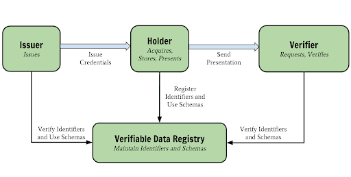
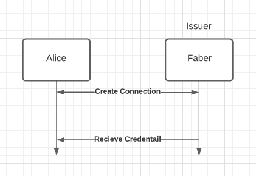

# Credentials

Verifiable credentials (VCs) are digital, cryptographically-protected data that you can use to prove you are you! With Indy, the data can be used by their holder to generate cryptographic zero-knowledge proofs (ZKPs—we will talk about these shortly) that can be checked by a verifier.



As per the recent figure, VCs involve 4 main parties:

- Issuer
- Holder
- Verifier
- Ledger

More about [Verifiable credentials model](https://www.w3.org/TR/vc-data-model/)

## Issuing Credentials

> TODO

## Receiving Credentials

> Note: This setup is assumed for a react native mobile agent

> Other platforms: To do

In order to receive a credential from a designated issuer agent, both receiver and issuer agents should have a connection established first.



Follow these steps to use AFJ in a mobile app to receive VCs

### 1. Configure agent

Please make sure you reviewed the [agent setup overview](../0-agent.md).

As per the recent figures, working with VCs requires some extra configuration when initializing your agent.

```ts
 const agentConfig: InitConfig = {
    ...
    autoAcceptConnections: true,
    autoAcceptCredentials: AutoAcceptCredential.ContentApproved,
    // This is just a sample, you will have to consult with issuers
    // to construct list of genesis paths
    indyLedgers: [
        {
        id: 'sovrin-main',
        isProduction: true,
        genesisPath: './genesis/sovrin-main.txn',
        }
    ],
    ...
};
```

- `autoAcceptConnections`: This will auto-accept the connection so it will automate first step for you.
- `autoAcceptCredentials`:
  - `AutoAcceptCredential.Always`: Always auto accepts the credential no matter if it changed in subsequent steps
  - `AutoAcceptCredential.ContentApproved` (Recommended): Needs one acceptation and the rest will be automated if nothing changes
  - `AutoAcceptCredential.Never`: Default. Never auto accept a credential
- `indyLedgers`: As per the recent figures (Verifiable data registry), you will need to define list of [ledgers](../4-ledger.md) according to the issuer preferences.

### 2. Configure event handlers

This handler is configured in a way that will prompt the user first of the received credential and credential asserts before accepting the credential
If you intend to auto accept any credential, just call `agent.credentials.acceptOffer(event.payload.credentialRecord.id)` directly without prompt.

```ts
const handleCredentialStateChange = async (agent: Agent, event: CredentialStateChangedEvent) => {
  console.log(
    `>> Credential state changed: ${event.payload.credentialRecord.id}, previous state -> ${event.payload.previousState} new state: ${event.payload.credentialRecord.state}`
  )

  if (event.payload.credentialRecord.state === CredentialState.OfferReceived) {
    const previewAttributes: CredentialPreviewAttribute[] =
      event.payload.credentialRecord.offerMessage?.credentialPreview.attributes || []

    // You can construct a list to display on some UI
    let message = '>> Offer Received <<\n'
    for (const credAttribute of previewAttributes) {
      message += `${credAttribute.name}: ${credAttribute.value}\n`
    }

    // Confirm accepting offer
    Alert.alert('Attention!', message, [
      {
        text: 'Accept',
        onPress: () => {
          agent.credentials.acceptOffer(event.payload.credentialRecord.id)
        },
      },
      {
        text: 'Reject',
        onPress: () => {
          console.log('User rejected offer')
        },
      },
    ])
  } else if (event.payload.credentialRecord.state === CredentialState.Done) {
    Alert.alert('Credential Received')
  }
}
```

### 3. Start by scanning QRCode

According to RFCs [Issue Credential Protocol 1.0](https://github.com/hyperledger/aries-rfcs/blob/main/features/0036-issue-credential/README.md), There are two ways for receiving a credential. Either you as a receiver will initiate a request and the issuer respond or the issuer initiates the process and you receive the credential by scanning a QRCode on the issuer agent side.

In this example we will follow the typical scenario of starting the process by showing a QR as the issuer (e.g. on a website), and the holder agent scanning the QR code.

```ts
const handleQRCodeScanned = async (agent: Agent, invitationUrl: string) => {
  console.log('Decoding connection Invitation from URL:', code)
  const connectionRecord = await agent.connections.receiveInvitationFromUrl(invitationUrl, {
    autoAcceptConnection: true,
  })
  console.log(`Received invitation connection record:${connectionRecord}`)
}
```

Note here that we set `autoAcceptConnection` to true so even if your global agent config autoAcceptConnection set to false this value will override the global value ONLY for this connection.

### 4. Displaying list of saved credentials

You can access the list of saved credentials on the wallet using the following example as a reference

```ts
const getAllCredentials = async (agent: Agent) => {
  const credentials = await agent.credentials.getAll()
  // Loop through credentials and create a list to display

  //To get specific credential details
  var lastCredentailRecord = credentials[credentials.length - 1]

  const previewAttributes: CredentialPreviewAttribute[] =
    lastCredentailRecord.offerMessage?.credentialPreview.attributes || []

  let someVar = ''
  for (const credAttribute of previewAttributes) {
    someVar += `${credAttribute.name}: ${credAttribute.value}\n`
  }

  //Do something ..
}
```

## References

- [Verifiable credentials model](https://www.w3.org/TR/vc-data-model/).
- [Issue Credential Protocol 1.0](https://github.com/hyperledger/aries-rfcs/blob/main/features/0036-issue-credential/README.md).
