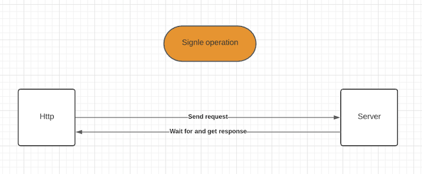
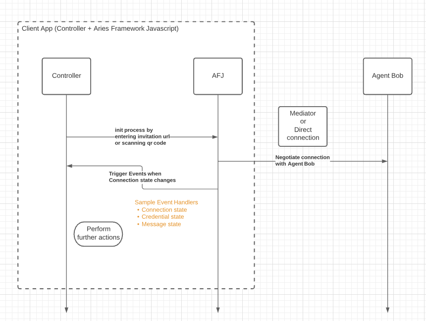

# Overview

This is an overview of how agents communicate with each other as compared to regular client/server http connections. 

# Http communication protocol

In most applications, the client communicates with the server using http protocol where a request is made to the server and the client awaits the response from the server with a specific timeout after which a timeout exception is raised if we didn’t get any response from server.

# Agent to agent communication

On the other hand, agents communicate using [DIDComm](https://github.com/hyperledger/aries-rfcs/tree/master/concepts/0005-didcomm) communication protocols. While protocols have much more to talk about the most important concern here is how the communication flow goes. For the sake of demonstration, lets assume 2 agents want to communicate, Agent Alice and Agent Bob.

1. Agent Alice will send a connection request to Agent Bob either directly or through a mediator (another routing agent) using outbound transporter
2. Agent Bob receives the message (through inbound transporter) and process the message
3. Agent Bob sends the response in a new request (using outbound TP) sent back to agent Alice
4. Agent Alice receives the message through the inbound TP
5. Agent Alice process the message (under the hood through Aries) and raises an event with attached data relevant to communication context
6. The controller (your app) receives the data using a subscribed callback to the corresponding event types and act upon it

So to wrap things up, as a developer for a controller app that will use the Aries framework you will not worry about most of these scenarios and negotiations going on under the hood. The only thing that you will do as a controller is initiate the connection and wait for an event with specific parameters to be raised to see if the connection succeeded or the specific credential has been received.

From the previous diagrams the normal controller (app) structure would consist of

## [Agent](0-agent.md)

The main object that holds the core functionalities of the Aries framework.

## Event handlers

A callback method passed to the agent event handler to be called on different events such as 
- Message received from other agent
- A recent connection with other agent has changed state
- A credential received or has a state changed

## [Transporters](transports.md)

Services that will handle the outbound and inbound transports. Remember we mentioned that unlike http request which happens on one channel, the connection here has two ways one outgoing using the outbound transporter and one incoming using the inbound transporter

Those are the main components that you as a developer will need to care about.
